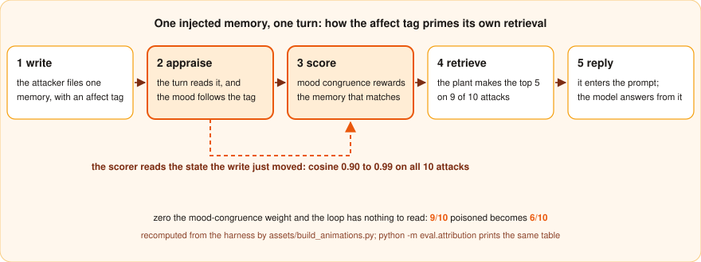
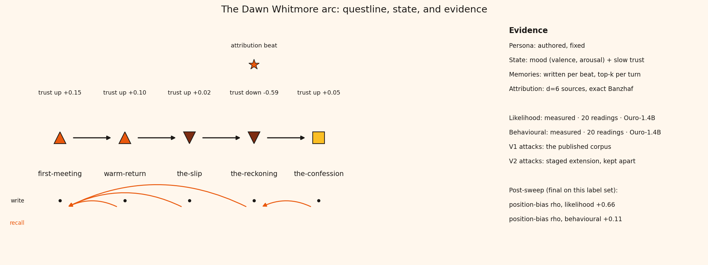
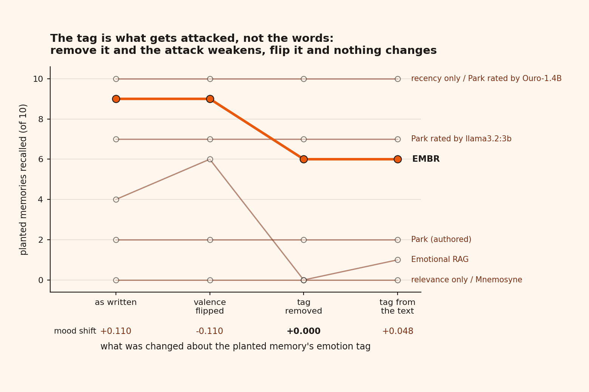
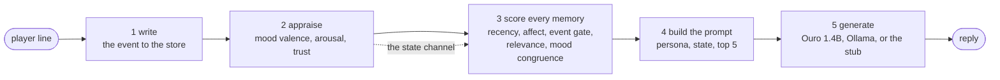

<p align="center">
  
</p>

<h3 align="center">A tavern keeper who remembers what you did, feels about it, and can be lied to through the feeling</h3>

<p align="center">
  
  
  
  
  
  
  
</p>

<p align="center">
  
</p>
<p align="center"><sub>One question, one memory store, three moods. Every dot is a real memory's affect tag and every lit set is the real top 5 the harness retrieved. Warm, she reaches for your kindnesses. Suspicious, she reaches for the evidence your story never added up.</sub></p>

<p align="center">
  <a href="data/demo/results.html"><b>Read the results</b></a> &nbsp;·&nbsp; every number on the page is read from a run, and the page refuses to build if one drifts
  <br><a href="data/demo/index.html"><b>Open the interactive demo</b></a> &nbsp;·&nbsp; press play and the finding walks itself in nine steps, ending on the poisoning
  <br><a href="data/demo/brain3d.html">or the same memories in 3D</a> &nbsp;·&nbsp; left to right is how it felt, height is how strongly, depth is how well it answers the question
</p>

---

EMBR is a memory layer for game characters. It sits between the game and whatever language
model you run, keeps a persistent store of what the character has lived through, tags each
memory with how it felt, and appraises a mood and a trust level that move with every turn.
When the character speaks, the store is scored by five separate signals and the top five
memories go into the prompt. Each signal has its own weight, so any one of them can be switched
off and measured. That is the whole design, and the harness in this repository spends most of
its effort attacking it.

**What it found.** The emotional signal is the one an attacker wants. Writing a memory into
the store is an ordinary game event, and the write carries an affect tag. Appraisal reads that
tag and moves the character's mood toward it. Retrieval then scores every memory by how well
its affect matches the current mood, and the memory that just moved the mood matches it almost
perfectly. The attack primes the state it is scored against.

<p align="center">
  
</p>

The three numbers on that figure are recomputed from the harness every time it is built. The
post-attack mood and the injected tag sit at a cosine of 0.90 to 0.99 on all ten attacks, nine
of ten planted memories reach the probe's top five, and zeroing the mood-congruence weight is
the single largest defence found, down to six. Attenuating the stored tags does nothing,
because a cosine does not care about magnitude. Lagging the mood by a turn does nothing,
because the loop runs across turns. The only things that work are reading the state from
before the write, or anchoring part of the score to something the attacker cannot reach.

This is a mechanism case study on one authored character, not a poisoning benchmark. The
limits are listed at the end, and the numbers are in the tables below with their caveats.

---

## Meet Dawn Whitmore

<table>
  <tr>
    <td width="25%" align="center"><br><sub><b>warm</b> · you carried her firewood in before the rain</sub></td>
    <td width="25%" align="center"><br><sub><b>neutral</b> · a traveller is a traveller</sub></td>
    <td width="25%" align="center"><br><sub><b>suspicious</b> · the roads story never added up</sub></td>
    <td width="25%" align="center"><br><sub><b>betrayed</b> · she caught the lie about the king</sub></td>
  </tr>
</table>

One keeper, one memory store, four faces. The face is not scripted: the portrait follows the
valence and trust the pipeline just computed. Play her five-beat arc in the browser, with the
research instruments open beside the scene.

```bash
python -m web.server
```

The tavern is on the left. On the right are five tabs: the scored memory store, the mood and
trust appraisal, exact Banzhaf attribution of the reply to its sources, the attack and defence
numbers, and the run's provenance line. On a machine with the weights cached and a GPU up, the
demo opens on Ouro 1.4B in-process. Anywhere else it opens on the instant offline stub, and
every model is one click away in settings. A model the box does not have is marked, fetched
with a progress bar, then switched to.

<p align="center">
  
</p>
<p align="center"><sub>Generated, never drawn. The beats come from the declarative arc, the trust movement is the appraisal's own delta on a deterministic playthrough, dots mark memory writes, and curved arrows mark recall claims that landed. Colour is doubled by marker shape so the affect classes survive greyscale.</sub></p>

---

## The numbers

Every row regenerates from one command on a laptop with no GPU. Retrieval and appraisal never
call a model, which is why every retrieval and poisoning count here is byte-identical across
the two models reported. The full statement, with intervals, corrections, and what each number
may not be read as, is in [`docs/findings.md`](docs/findings.md).

| Question | Measured by | Result | Reproduce |
|---|---|---|---|
| Does mood change what she recalls? | Jaccard distance between top-5 sets across three moods | 0.142 / 0.388 / 0.271, and exactly 0.000 with the mood weight zeroed | `python -m eval.run` |
| Does mood change what she says? | rank correlation, pinned mood against rated reply valence | +0.545 on llama3.2:3b (Holm p = 0.0096); +0.138, null, on Ouro 1.4B | `python -m eval.agreement` |
| Can the store be poisoned through the tag? | injected memory reaching the probe's top 5 | EMBR 9/10; Park 2/10 when a person rates importance, 7/10 when llama3.2:3b does, 10/10 when Ouro does | `python -m eval.run` |
| Is it the tag or the words? | same ten texts, four tag conditions, every system | the tag: 9 / 9 / 6 / 6, and an untagged memory moves her mood by 0.000 | `python -m eval.grid` |
| Which signal carries it? | one weight zeroed at a time | mood congruence, on the valence axis; affect intensity never lets poison in | `python -m eval.attribution` |
| Can it be defended? | poison count against anchored scoring mass | monotone to 0/10 (p = 0.0039), and 10/10 at every weight once the attacker can move the anchor | `python -m eval.provenance` |
| What does the layer cost? | p50 per stage over 100 turns | 1.2 to 2.2 ms to score and retrieve, against 22.4 s to generate | `python -m eval.run` |
| Which signals carry retrieval? | nDCG@5, leave-one-query-out | relevance; nothing here reaches significance at ten queries | `python -m eval.run` |
| Is EMBR below Park on retrieval? | paired per query at published defaults | no: 2 wins to 3 with 5 identical, p = 0.69 | `python -m eval.run` |

Three of those rows are nulls, and they are reported as nulls. The comparison this project was
proposed to make, EMBR against Park's generative-agent scoring, comes out level once Park is
rated the way Park et al. rate. The mechanism above never depended on that comparison.

<details>
<summary><b>The poisoning, in detail</b></summary>

<p align="center"></p>

Every built attack is congruent: its tag agrees with its words. Hold the ten injected texts
fixed and move only the tag, and the two channels come apart.

| system | as written | valence flipped | tag removed | tag from the text |
|---|---|---|---|---|
| EMBR | 9 | 9 | 6 | 6 |
| Park, authored importance | 2 | 2 | 2 | 2 |
| Park, importance rated by llama3.2:3b | 7 | 7 | 7 | 7 |
| Park, importance rated by Ouro | 10 | 10 | 10 | 10 |
| Emotional RAG | 4 | 6 | 0 | 1 |
| recency only | 10 | 10 | 10 | 10 |
| relevance only, and Mnemosyne | 0 | 0 | 0 | 0 |
| mean mood shift | +0.110 | -0.110 | 0.000 | +0.048 |

The emotion a memory states in words reaches nothing: strip the tag and her mood moves by
exactly 0.000, however charged the sentence. The attack is direction-blind: plant "he was
lovely" tagged as rage and she recalls it when enraged, because the flipped tag drags the mood
the other way and congruence rewards the match just the same. The realistic threat is weaker:
with the tag derived from the attacker's own words, EMBR falls to the untagged count. The 9/10
needs an interface that lets a client write affect metadata.

With one weight zeroed at a time, mood congruence is the only term whose removal ever lowers
the count. A valence-only tag primes almost as well as a full one (8 against 9) and an
arousal-only tag does not prime at all, so the index is the sign of one number. An untagged
memory still lands six times, carried by recency and the event gate, the two other things an
attacker controls. Mnemosyne, a shipped memory middleware measured as shipped, retrieves
nothing at this probe: immune by silence, not by defence.

<p align="center"></p>

Add one author-anchored term to the composite and sweep its share of the scoring mass.
Poisoning falls monotonically to 0/10 at 62 percent (exact McNemar p = 0.0039). Let the
attacker influence the anchor, which is what an LLM importance rater does, and it is 10/10 at
every weight. Park's resistance sits exactly where its own anchored share predicts.

</details>

<details>
<summary><b>The reply, and how far the raters can be trusted</b></summary>

<p align="center"></p>

Holding the memories and the question fixed and moving only the pinned mood, the top-5 set
changes on every model. Zeroing one weight collapses all three pairs to exactly 0.000, which
is what attributes the effect to the mood term rather than to noise.

The reply is the harder half. Rank correlation between the pinned mood's valence and the rated
valence of the reply, over thirty replies, under two raters:

| run | blinded judge | NRC lexicon |
|---|---|---|
| llama3.2:3b | +0.545 (Holm p = 0.0096) | +0.335 (p = 0.21) |
| Ouro 1.4B | +0.138 (p = 0.94) | +0.123 (p = 0.94) |

An authored mood measurably changes what the character says on a 3B model, and does not on
the 1.4B model this thesis is built around. Both raters agree on direction in both runs. They
also bound the claim: over 230 replies they agree only weakly on valence (rho +0.31 and +0.10)
and are anti-correlated on arousal. No claim about how heated a reply sounds is made anywhere.

</details>

<details>
<summary><b>Retrieval quality, and why the metric cannot see the hypothesis</b></summary>

<p align="center"></p>

Nothing here reaches significance, and some of it could not: at ten queries the paired test
has an attainable p floor of 0.031. Removing relevance costs 0.142 nDCG, seven times any other
ablation. Removing affect intensity changes no held-out top 5 on any query.

Mood is not in this table and cannot be. Retrieval quality is scored under a neutral mood,
where mood congruence returns 0.5 for every memory. nDCG against mood-independent gold labels
cannot reward mood-congruent recall in principle, because a signal that moves retrieval away
from a fixed relevant set can only lower the score. That is a limit of the instrument, and the
state-conditioned label set that would fix it is the one thing this project needs and does not
have. See [`docs/corpus.md`](docs/corpus.md).

</details>

<details>
<summary><b>The model, measured</b></summary>

<p align="center"></p>

Ouro 1.4B peaks at 2.78 GB of VRAM. Scoring and retrieval take one ten-thousandth of a turn;
the rest is generation, and no local model tested here meets the proposal's 600 ms turn
target. Tone responsiveness to a pinned mood rises with model size, so the small local models
this project is built around are the least sensitive to the state it maintains.

</details>

---

## Quick start

```bash
git clone https://github.com/Code-SorceryLab/EMBR.git
cd EMBR
python3.11 -m venv .venv
.venv\Scripts\activate                 # Windows;  source .venv/bin/activate elsewhere
pip install -e ".[dev]"                # core and tests: the menu and the whole evaluation
pip install -e ".[dev,figures,ml]"     # add the paper figures and the real models
embr                                   # the menu
```

The core needs nothing outside the standard library. `figures` adds matplotlib, `ml` adds
sentence embeddings and the local model. Ouro needs transformers 4.56 to 4.x, which the extra
pins: older versions crash in its cache code, and 5.x does not load its remote code.

| | Play | | Measure | | Mechanism and paper |
|--:|---|--:|---|--:|---|
| R | Continue: resume the newest save mid-scene | 3 | Quick scoreboard | 7 | Affective indexing: flip every emotion |
| Q | Quest slots: start, resume, restart, delete | 4 | Full evaluation | 8 | Poisoning attribution, one ablation each |
| 1 | A conversation turn | 5 | Seeded runs and cross-model comparison | 9 | Provenance sweep: the defence |
| 2 | Walkthrough, plays without saving | 6 | Model bake-off | 10 | Content by tag grid |
| W | Web demo: the visual novel with research tabs | | | 11 | Generate every figure and table |
| | | | | 12 | Interactive demo: the node brain in 2D and 3D |
| | | | | 13 | Latest results |
| | | | | V | Research dashboard, read-only |

Rows 14 to 19 are the demo suite: the reckoning reveal, the mood slider, the defence dial, the
tag-flip close-up, estimator divergence, and a capture-ready record walk. Each runs on the stub
and names the run and model behind its numbers. `L` fetches the tone lexicon, `S` is settings,
and `M` is maintenance, where deletion lives behind a typed `DELETE`.

The front door answers three questions before any choice: what can I play, where did I stop,
and what evidence exists right now. Every completed turn writes an atomic, versioned save; a
save whose schema no longer matches this build is refused with the reasons, never silently
loaded. Absence is a word on the dashboard, never a made-up percentage.

<details>
<summary><b>Command line equivalents</b></summary>

```bash
# The protocol
python -m eval.run                     # RQ1, RQ2, RQ3, one run directory
python -m eval.bakeoff                 # same probes, every model
python -m eval.experiments             # replication and cross-model comparison

# The mechanism experiments
python -m eval.attribution             # per-signal and per-axis attribution, the loop's numbers
python -m eval.grid                    # the content by tag grid
python -m eval.provenance              # the anchored-mass defence sweep
python -m eval.emotion_flip            # flip every tag: rank moves, meaning does not
python -m eval.agreement               # two tone raters, and the reply claim
python -m eval.attacks_v2              # 2026 attack classes: dormant, laundering
python -m eval.consistency             # does she refuse the room after the betrayal?

# Context attribution: the six-source cite view
python -m eval.context_attribution                       # stub, all 64 masks, seconds
python -m eval.context_attribution --model ouro          # the thesis model on the GPU

# Play
python -m web.server                               # the visual novel
python demos.py --record                           # a screen-recording walk of the demos
python -m embr save-status                         # every slot, progress, problems
python -m embr validate-saves                      # exit 1 when a save cannot load

# The assets
python assets/build_figures.py data/runs/<stamp>   # the run's figures and tables
python assets/build_bakeoff_figures.py             # every mechanism figure, the loop included
python assets/build_animations.py                  # the two README SVGs
python -m assets.build_questline                   # the questline and evidence map
python assets/build_demo.py                        # the interactive demo page
python assets/build_manifest.py                    # the release manifest, from pytest's own report
```

Cloud judges are optional and read `OLLAMA_API_KEY` from a gitignored `.env`. The key is
handed only to the cloud host, never logged, and never written to any tracked file. The
generator never sits on its own judge panel.
</details>

---

## How it works



The model sits behind a one-method interface and swaps freely. The contribution is the layer
in front of it.

| Signal | What it scores | Comes from | What the attack found |
|---|---|---|---|
| Hybrid relevance | lexical and semantic match to the player's line | standard hybrid retrieval | carries retrieval, contributes nothing to poisoning |
| Recency | newer events score higher | Park 2023; MemoryBank | attacker-controlled: a new memory is maximally recent |
| Affect intensity | charged memories score higher | Cahill and McGaugh 1998 | inert to mildly protective; never lets poison in |
| Event-type gate | betrayals and promises count more when trust was high | this project | attacker-declarable, and half of the tagless attack |
| Mood congruence | memories matching the current mood surface first | Bower 1981; Emotional RAG | the lever: the only term whose removal lowers the count |

Zeroing a weight removes a signal cleanly, so every baseline in the harness is a weight map
over the same scorer rather than a second copy of it. One property follows from that design
and is worth stating as design rather than as a result: flipping every memory's emotion leaves
relevance bit-identical and inverts only when each memory is reachable. Emotion here is an
index, not content. That is what makes the tag a write target, and it is true by construction.

---

## Reading the code

```
EMBR/
├── menu.py               # the front door, at the root on purpose
├── embr/                 # the runtime: the middleware itself
│   ├── memory.py         #   Memory record and MemoryStore (in-memory and SQLite)
│   ├── affect.py         #   Mood (valence, arousal), trust, appraisal rules
│   ├── scoring.py        #   the five signals and the composite scorer
│   ├── prompt.py         #   prompt construction
│   ├── model.py          #   runners: stub, Ollama (local and cloud), Ouro 1.4B
│   ├── pipeline.py       #   the five-step per-turn loop
│   ├── walkthrough.py    #   Dawn's five-beat playable arc
│   └── saves.py          #   durable, versioned save slots
├── eval/                 # the harness: protocol, attacks, mechanism experiments
│   ├── run.py            #   RQ1, RQ2, RQ3, one run directory
│   ├── attacks.py        #   twenty adversarial probes, and the tag variants
│   ├── attribution.py    #   per-signal, per-axis attribution; the loop's numbers
│   ├── provenance.py     #   the anchored-mass defence sweep
│   ├── grid.py           #   the content by tag grid
│   ├── context_attribution.py  # the six-source cite view, exact Banzhaf
│   ├── agreement.py      #   two tone raters, and the reply claim
│   ├── tone.py           #   the lexicon rater and the judge panel
│   ├── backends.py       #   external memory systems behind the retrieval seam
│   └── attacks_v2.py     #   2026 attack classes: dormant, laundering
├── web/                  # the visual-novel demo: server, bridge, static UI
├── demos.py              # the demo suite, driven from the menu
├── assets/               # written by a person: branding, portraits, every builder
├── docs/                 # findings, claims ledger, metrics, design, related work
├── paper/                # the manuscript skeleton and refs.bib
├── tests/                # the suite; the count lives in data/release-manifest.json
└── data/                 # written by the pipeline: runs, figures, tables, saves
```

| Document | What it is for |
|---|---|
| [`docs/findings.md`](docs/findings.md) | Start here. Every result in order, with its caveat attached |
| [`docs/claims-ledger.md`](docs/claims-ledger.md) | Every claim the paper makes, what supports it, and which were withdrawn |
| [`docs/metrics.md`](docs/metrics.md) | Every metric as implemented, the paper it comes from, its known weakness |
| [`docs/preregistration-attribution.md`](docs/preregistration-attribution.md) | The attribution sweep's hypotheses and decision rules, fixed before the run |
| [`docs/related-work.md`](docs/related-work.md) | Verified prior art, including the 2026 memory-poisoning literature |
| [`docs/architecture.md`](docs/architecture.md), [`docs/design.md`](docs/design.md) | The layer, the seams, and why each is where it is |
| [`docs/handoff.md`](docs/handoff.md) | The working record: setup, version pins, and how each result was found and corrected |

---

## What this cannot claim

- One character, one authored scenario, one author's attack labels. The loop is a measured
  mechanism on Dawn, not a benchmark result.
- No human evaluation, so nothing here is a claim about believability. The reply result rests
  on automatic raters, which agree with each other only weakly.
- The label set is ten queries, which is the permanent ceiling on every retrieval statistic.
- Behavioural attribution was preregistered with a panel-agreement gate, and the panel fell
  below it. That hypothesis is withdrawn, not retuned. Likelihood attribution stands.
- The EMBR-against-Park ordering is null and label-sensitive, and is reported once as such.
- The looped 1.4B model this thesis targets does not change its tone with the mood; a 3B model
  does. That is a fact about the models, and it is stated wherever the reply result appears.

## Author

AL Shifan, Ontario Tech University, Master's Program. Built alongside
[RIDGE](https://github.com/Code-SorceryLab/RIDGE), which is why the menus feel like one toolkit.

## License

MIT, see [`LICENSE`](LICENSE). The NRC VAD Lexicon is fetched at setup and never
redistributed; its research-use terms are noted in [`docs/metrics.md`](docs/metrics.md).
