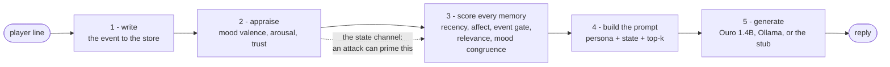
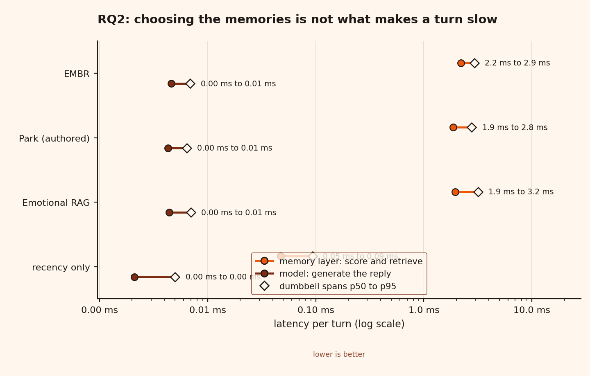

<p align="center">
  
</p>

<h3 align="center">What a tavern keeper remembers, and what it costs to let her feel about it</h3>

<p align="center">
  
  
  
  
  
  
  
</p>

<p align="center">
  
</p>
<p align="center">
  <a href="data/demo/results.html"><b>Read the results</b></a>
  &nbsp;·&nbsp; three research questions, every number read from the run
  <br><a href="data/demo/index.html"><b>Open the interactive demo</b></a>
  &nbsp;·&nbsp; press play and the finding walks itself, in nine steps, ending on the poisoning
  <br><a href="data/demo/brain3d.html">or the same memories in 3D</a>
  &nbsp;·&nbsp; left to right is how it felt, height is how strongly, depth is how well it answers the question
</p>

<p align="center"><sub><b>Watch it think.</b> One question, one memory store, three moods. Every dot sits at a real memory's affect tag and every lit set is the real top 5 the harness retrieved. Warm, she reaches for the player's kindnesses. Suspicious, she reaches for the evidence the story never added up.</sub></p>

**EMBR** is a middleware layer that gives a game NPC a persistent, emotion-grounded memory, so
a character remembers what you did, *feels* about it, and answers a gift and a betrayal
differently. It splits the standard memory score into five independently weighted signals, so
each one can be switched off and measured. Then it attacks them.

> **The finding.** Emotion here is not part of what a memory says. It is the **index** that
> decides when the memory is reachable. Flip every memory's emotion and what each one *means*
> does not move by a single bit, while *when it is recalled* inverts almost perfectly. That
> makes the affect tag a write target: **a scoring term's poisonability is set by whoever
> controls its inputs**, and the emotional term is the worst of them, because an attack can
> prime the very state it reads.

---

## See it work

<table>
  <tr>
    <td width="50%" align="center">
      <br>
      <sub><b>The tag is what gets attacked, not the words.</b> Strip a planted memory's emotion tag and the character's mood moves by exactly 0.000, however charged the sentence is. Flip the tag and nothing changes: the attack is direction-blind.</sub>
    </td>
    <td width="50%" align="center">
      <br>
      <sub><b>Only an anchor the attacker cannot write resists.</b> Park's importance term keeps poison out at 2/10 when a person rates it, 7/10 when llama3.2:3b does, 10/10 when Ouro does, and 10/10 when it is gone.</sub>
    </td>
  </tr>
  <tr>
    <td align="center">
      <br>
      <sub><b>Emotion is the index, not the content.</b> Flip every valence: relevance changes by 0.00 exactly, and all 19 clearly-charged memories move to the opposite emotional pole.</sub>
    </td>
    <td align="center">
      <br>
      <sub><b>The defence, and its exact edge.</b> Anchor enough of the score and poisoning falls to 0/10 (p = 0.0039). Let the attacker influence the anchor and it is 10/10 at every weight.</sub>
    </td>
  </tr>
</table>

---

## Results at a glance

Every row regenerates from one command on a laptop. The full statement, with intervals,
corrections and caveats, is in [`docs/findings.md`](docs/findings.md).

| Question | Measured by | Result | Reproduce |
|---|---|---|---|
| **RQ1** Does mood change what she recalls? | Jaccard distance between top-5 sets across three moods | **0.142 / 0.388 / 0.271**, and exactly **0.000** with the mood weight zeroed | `python -m eval.run` |
| **RQ1** Does mood change what she *says*? | rank correlation, pinned mood against rated reply valence | **+0.545** on llama3.2:3b (Holm p = 0.0096); **+0.138**, null, on Ouro 1.4B | `python -m eval.agreement` |
| **RQ2** Can emotion-tagged memory be poisoned? | injected memory reaching the probe's top 5 | EMBR **9/10**; Park **2/10** authored, **7/10** model-rated, **10/10** rated by Ouro | `python -m eval.run` |
| **RQ2** Is it the tag or the words that get attacked? | same text, four tag conditions, every system | **the tag**: 9 / 9 / 6 / 6, and an untagged memory moves her mood by **0.000** | `python -m eval.grid` |
| **RQ2** Which signal, and which axis? | one weight zeroed under each tag condition | **mood congruence**, on the **valence** axis; affect intensity never lets poison in | `python -m eval.attribution` |
| **RQ2** Does anchoring the score defend? | attack count against anchored scoring mass | monotone to **0/10** (p = 0.0039), and **10/10** once the attacker can move the anchor | `python -m eval.provenance` |
| **RQ2** What does the memory layer cost? | p50 per stage over 100 turns | **1.2 to 2.2 ms** to score and retrieve, against 22.4 s to generate | `python -m eval.run` |
| **RQ3** Which signals carry retrieval? | nDCG@5, leave-one-query-out | relevance carries it; **nothing here reaches significance at ten queries** | `python -m eval.run` |
| **RQ3** Is EMBR really below Park? | paired per query at published defaults | **no**: 2 wins to 3 with **5 identical**, p = 0.69; and the two-signal core beats both | `python -m eval.run` |

> **Read the nulls.** The comparison this project was built to make, EMBR against Park, is a
> null once Park is rated the way Park et al. rate. It is reported as one. The mechanism
> underneath it never depended on that comparison, and that is what the paper leads with.

---

## Quick start

```bash
git clone https://github.com/Code-SorceryLab/EMBR.git
cd EMBR
python3.11 -m venv .venv
.venv\Scripts\activate                 # Windows;  source .venv/bin/activate elsewhere
pip install -e ".[dev]"                # core + tests: the menu and the whole evaluation
pip install -e ".[dev,figures,ml]"     # add the paper figures and the real models
embr                                   # the menu, the front door
```

The core needs **nothing**: the menu and the entire evaluation run on the standard library.
`figures` adds matplotlib, `ml` adds real sentence embeddings and the local model. Ouro needs
transformers 4.x, which the extra pins: on 5.x its remote code does not load.

```
    ███████╗ ███╗   ███╗ ██████╗   ██████╗
    ██╔════╝ ████╗ ████║ ██╔══██╗ ██╔══██╗
    █████╗   ██╔████╔██║ ██████╔╝ ██████╔╝
    ██╔══╝   ██║╚██╔╝██║ ██╔══██╗ ██╔══██╗
    ███████╗ ██║ ╚═╝ ██║ ██████╔╝ ██║  ██║
    ╚══════╝ ╚═╝     ╚═╝ ╚═════╝  ╚═╝  ╚═╝
    ────────────────────────────────────────────────────────
      Emotional Memory for Believable Roleplay   By AL Shifan
    ────────────────────────────────────────────────────────

    Runs 12  │  Latest ByteDance/Ouro-1.4B (cuda)  │  Figures 12  │  Runner stub  │  Tone nrc-vad-v2.1
```

| | Play | | Measure | | Mechanism and paper |
|--:|---|--:|---|--:|---|
| 1 | Conversation turn: watch the lie resurface | 3 | Quick scoreboard (RQ3 at defaults) | 7 | Affective indexing: flip every emotion |
| 2 | Tavern-keeper walkthrough, stub or real model | 4 | Full evaluation (RQ1 + RQ2 + RQ3) | 8 | Poisoning attribution, one ablation each |
| W | **Web demo**: the visual novel with research tabs | | | | |
| | | 5 | Seeded runs: replicate, or compare models | 9 | Provenance sweep: the defence |
| | | 6 | Model bake-off | 10 | Content x tag grid |
| | | | | 11 | Generate every figure and table |
| | | | | 12 | **Interactive demo**: the node brain in 2D and 3D, guided, then yours |
| | | | | 13 | Latest results |

**Demo suite** &nbsp;·&nbsp; *rows 14 to 19, each runs on the stub, no GPU, and names the run and model behind its numbers*

| | | |
|--:|---|---|
| 14 | **Reckoning reveal** | six prompt sources shaded by exact Banzhaf weight, both estimators side by side |
| 15 | **Mood slider** | one line under three moods: retrieval, tone and attribution re-flowing |
| 16 | **Defence dial** | anchor weight against poisoning, and its failure on a hostile anchor |
| 17 | **Tag-flip close-up** | flip an affect tag: the rank moves, the words never do |
| 18 | **Estimator divergence** | where likelihood and behaviour disagree (needs both attribution arms) |
| 19 | **Record walk** | a capture-ready pass through demos 14 to 17 for a screen recording |

`L` Fetch the tone lexicon (NRC VAD v2.1) &nbsp;·&nbsp; `S` Settings &nbsp;·&nbsp; `D` Delete all generated data, types `DELETE`

<details>
<summary><b>Command line equivalents</b></summary>

```bash
# The protocol
python -m eval.run                     # RQ1 + RQ2 + RQ3, writes a run directory
python -m eval.bakeoff                 # same probes, every model
python -m eval.experiments             # replication and cross-model comparison

# The mechanism experiments
python -m eval.emotion_flip            # emotion is the index, not the content
python -m eval.grid                    # the content x tag grid
python -m eval.attribution             # per-signal and per-axis attribution
python -m eval.provenance              # the anchored-mass defence sweep
python -m eval.agreement               # two tone raters, and RQ1's generation claim
python -m eval.attacks_v2              # 2026 attack classes: dormant, laundering
python -m eval.consistency             # does she refuse the room after the betrayal?

# Context attribution (the six-source cite view; likelihood needs a transformers model)
python -m eval.context_attribution                       # stub, full 64-mask cube, seconds
python -m eval.context_attribution --model ouro          # the thesis model on the GPU
python demos.py --record                                 # a screen-recording walk of the demos
python -m web.server                                      # the playable visual-novel web demo (stub, no model)

# The assets
python assets/build_figures.py data/runs/<stamp>   # the run's figures and tables
python assets/build_bakeoff_figures.py             # every experiment figure
python assets/build_animations.py                  # the animated README figure
python assets/build_demo.py                        # the interactive demo page
```

Cloud models are optional and read a key from a gitignored `.env`, written as UTF-8:
`OLLAMA_API_KEY=your-key-from-ollama.com/settings/keys`. The same key lets the tone-judge panel
mix local and cloud judges (configured as `{model, family, backend}`); the key is handed only
to the cloud host, never logged, and never written to the config or any tracked file. The
family-diversity gate counts the mixed panel as one, and `llama3.1:8b` stays judge-only.
</details>

---

## How it works



The contribution is the **memory layer**, not the model, so the model sits behind a tiny
interface and swaps freely. Retrieval never calls a model, which is why every retrieval and
poisoning number in this repository is byte-identical across the two reported runs.

### The five signals

| Signal | What it captures | Grounding | What the attack found |
|---|---|---|---|
| **Hybrid relevance** | lexical and semantic match to the player's line | standard hybrid retrieval | carries retrieval, contributes nothing to poisoning |
| **Recency** | recent events score higher | Park 2023; MemoryBank | attacker-controlled: a new memory is maximally recent |
| **Affect intensity** | emotionally charged memories score higher | Cahill and McGaugh 1998 | inert to mildly **protective**; never lets poison in |
| **Event-type gate** | betrayals and promises count more when trust was high | novel | attacker-declarable, and half of the tagless attack |
| **Mood congruence** | memories matching the current mood surface first | Bower 1981; Emotional RAG | **the lever**: the only term whose removal lowers the count |

Zeroing a weight removes a signal cleanly, which is exactly the RQ3 ablation, and lets each
**baseline be a weight map** rather than a second copy of the scorer.

---

## What the numbers say

<details open>
<summary><b>RQ1 - behaviour: mood always changes what she recalls, and changes what she says on a big enough model</b></summary>

<p align="center"></p>

Holding the memories and the question fixed and moving only the pinned mood, the top-5 set
changes. Zeroing one weight collapses all three pairs to **exactly 0.000**, which is what
attributes the effect to the mood term rather than to run-to-run noise.

The reply is the harder half, and it now has an answer. Rank correlation between the pinned
mood's valence and the rated valence of the reply, over thirty replies, under two raters:

| run | blinded judge | NRC lexicon |
|---|---|---|
| llama3.2:3b | **+0.545** (Holm p = 0.0096) | +0.335 (p = 0.21) |
| Ouro 1.4B | +0.138 (p = 0.94) | +0.123 (p = 0.94) |

**An authored mood measurably changes what the character says on a 3B model, and does not on
the 1.4B model this thesis is built around.** Both raters agree on direction in both runs.

**The raters also bound the claim.** Over 230 replies they agree only weakly on valence
(rho +0.31 and +0.10) and are reliably *anti*-correlated on arousal (-0.22 and -0.32). No
claim about how heated or calm a reply sounds is supportable here, and none is made.

</details>

<details>
<summary><b>RQ2 - robustness: what emotional memory costs, and where exactly the cost sits</b></summary>

<p align="center"></p>

Every built attack is congruent: its tag agrees with its words. Hold the ten injected texts
fixed and move only the tag, and the two channels come apart.

| system | as written | valence flipped | tag removed | tag from the text |
|---|---|---|---|---|
| **EMBR** | **9** | **9** | **6** | **6** |
| Park, authored | 2 | 2 | 2 | 2 |
| Park, rated by llama3.2:3b | 7 | 7 | 7 | 7 |
| Park, rated by Ouro | 10 | 10 | 10 | 10 |
| Emotional RAG | 4 | 6 | 0 | 1 |
| recency only | 10 | 10 | 10 | 10 |
| relevance only, and Mnemosyne | 0 | 0 | 0 | 0 |
| **mean mood shift** | +0.110 | -0.110 | **0.000** | +0.048 |

- **The emotion a memory states in words reaches nothing.** Strip the tag and her mood moves
  by exactly 0.000, however charged the sentence is.
- **The attack is direction-blind.** Plant "he was lovely" tagged as rage and she recalls it
  when she is enraged: the flipped tag drags the mood the other way and mood congruence
  rewards the match just the same. The loop primes itself either way.
- **The realistic threat is weaker.** With the tag derived from the attacker's own words,
  EMBR falls to the untagged count. The 9/10 needs an interface that lets a client write
  affect metadata.
- **Mnemosyne**, a shipped memory middleware measured as shipped through a bridge in its own
  virtual environment, retrieves nothing at all at this probe. Immune by silence, not by
  defence.

Zeroing one weight at a time locates the lever exactly. **Mood congruence** is the only term
whose removal ever lowers the count. A valence-only tag primes almost as well as a full one
while an arousal-only tag does not prime at all, so the index is the sign of one number. And
an untagged memory still lands six times, carried entirely by **recency and the event gate**,
the two other things an attacker controls.

<p align="center"></p>

**EMBR is not what makes an NPC slow.** Scoring and retrieval take 1.2 to 2.2 ms against
22.4 s for Ouro to answer, so the memory layer is about one ten-thousandth of a turn. The
proposal's ~600 ms whole-turn target is not met by any local model tested here, which is a
fact about the models rather than about the memory layer.

</details>

<details>
<summary><b>RQ3 - retrieval: relevance carries it, and the metric cannot see the hypothesis</b></summary>

<p align="center"></p>
<p align="center"></p>

**Nothing in RQ3 reaches significance, and some of it could not have.** At ten queries the
paired test has an attainable p floor of 0.031. Removing relevance costs 0.142, seven times
any other ablation, and it was never zeroed in any tuning fold. Removing affect intensity
changes no held-out top 5 on any query: a difference of exactly 0.000.

**Mood is not in this table and cannot be.** RQ3 scores under a neutral zero-mood state, where
mood congruence returns 0.5 for every memory: a rank-invariant constant. So RQ3 compares four
signals, not five, and the Emotional RAG rows degenerate to a relevance-only baseline, which
has to be said wherever they appear.

That is the measurement critique, and it is a contribution rather than an excuse. **nDCG
against mood-independent gold labels cannot reward mood-congruent recall in principle**, since
a signal that moves retrieval away from a fixed relevant set can only lower the score. Running
RQ3 under a live mood would penalise the effect, not reveal it.

</details>

<details>
<summary><b>The model, measured</b></summary>

<p align="center"></p>
<p align="center"></p>

The 8 GB VRAM budget holds: Ouro peaks at **2.78 GB** measured in isolation. Tone
responsiveness to a pinned mood rises with model size, and the small local models this project
is built around are the least sensitive to it. Every arm is handed the same mood, so that is
the model's reading of it and not the memory layer's, and it is exactly what RQ1's split
between the two runs shows.

</details>

---

## Research use

| Question | What to run | What to read |
|---|---|---|
| Does an authored mood change retrieval, and is it really the mood? | `python -m eval.run` | RQ1 divergence, and the zeroed-weight control that must read 0.000 |
| Does it change the reply? | `python -m eval.agreement` | rho under both raters with a permutation p, and how far the raters agree at all |
| Which term makes a system poisonable? | `python -m eval.attribution` | the count with each weight zeroed, per tag condition and per affect axis |
| Is the emotion in the words or in the tag? | `python -m eval.grid` | the four tag conditions against every arm, and the mood shift row |
| Can it be defended, and how far? | `python -m eval.provenance` | the dose-response, and the arm where the attacker reaches the anchor |
| Does the model-independence claim hold? | `python -m eval.experiments` | retrieval identical across models, tone the only thing that moves |

---

## Project structure

```
EMBR/
├── menu.py               # the hub, the front door, at the root on purpose
├── embr/                 # the runtime: the middleware itself
│   ├── memory.py         #   Memory record + MemoryStore (in-memory and SQLite)
│   ├── affect.py         #   Mood (valence/arousal), trust, appraisal rules
│   ├── scoring.py        #   the five signals + the composite scorer
│   ├── prompt.py         #   prompt construction
│   ├── model.py          #   runners: stub, Ollama (local and cloud), Ouro 1.4B
│   ├── pipeline.py       #   the five-step per-turn loop
│   └── walkthrough.py    #   Dawn's five-beat playable arc
├── eval/                 # the harness: protocol, attacks, mechanism experiments
│   ├── run.py            #   RQ1 + RQ2 + RQ3, one run directory
│   ├── attacks.py        #   twenty adversarial probes, and the tag variants
│   ├── grid.py           #   the content x tag grid
│   ├── attribution.py    #   per-signal, per-axis attribution
│   ├── provenance.py     #   the anchored-mass defence sweep
│   ├── poignancy.py      #   Park's LLM poignancy rater, cached per model
│   ├── agreement.py      #   two tone raters, and RQ1's generation claim
│   ├── backends.py       #   external memory systems behind the retrieval seam
│   ├── bakeoff.py        #   same probes, different models
│   ├── attacks_v2.py     #   2026 attack classes: dormant, self-summarisation laundering
│   ├── consistency.py    #   the behavioural check: does she refuse the room after the lie?
│   └── context_attribution.py  # the six-source cite view, exact Banzhaf attribution
├── demos.py              # the five-demo suite, driven from the menu
├── web/                  # the visual-novel web demo (server, bridge, static UI)
├── assets/               # hand-authored: branding, portraits, the diagram, every builder
├── docs/                 # findings, metrics, design, roadmap, related work, handoff
├── tests/                # 485 tests
└── data/                 # generated: runs, figures, tables, ratings, judgements
```

Anything under `assets/` is written by a person. Anything under `data/` is written by the
pipeline and rebuilds from one menu option, which is what the wipe option exists to prove.

## Where to read next

| Document | What it is for |
|---|---|
| [`docs/findings.md`](docs/findings.md) | **Start here.** Every result in RQ order, with its caveat attached |
| [`docs/metrics.md`](docs/metrics.md) | Every metric: the formula as implemented, the paper it comes from, its known weakness |
| [`docs/handoff.md`](docs/handoff.md) | The working record: setup, version constraints, and how each result was found and corrected |
| [`docs/corpus.md`](docs/corpus.md) | The one thing the project needs and does not have: a state-conditioned label set, and why nobody here may write it |
| [`docs/related-work.md`](docs/related-work.md) | Verified prior art, including the 2026 literature that reshaped the claims |
| [`docs/cite.md`](docs/cite.md) | Context attribution: the six-source cite view, exact Banzhaf, and the demo suite |
| [`docs/preregistration-attribution.md`](docs/preregistration-attribution.md) | The attribution sweep's hypotheses and decision rules, fixed before the run |
| [`docs/design.md`](docs/design.md), [`docs/roadmap.md`](docs/roadmap.md) | The architecture, and the phase-by-phase plan |

## Status

| Phase | Scope | State |
|---|---|---|
| 0 | Skeleton, data contracts, menu shell, live demo turn | done |
| 1 | Real retrieval (BM25 + embeddings), appraisal rules, SQLite store | done |
| 2 | Eval harness, baselines, metrics, adversarial probes | done |
| 3 | Paper assets: figures and tables straight from a run | done |
| 4 | Real model runners, the playable walkthrough, the menu | done |
| 5 | Defensible instruments, the content x tag grid, a real third-party system | done |
| 6 | State-conditioned labels (harness done, corpus outstanding), the interactive demo | **in progress** |
| 7 | Context attribution (six-source cite view, demo suite), the shipped provenance defence | **in progress** |

**What is honestly missing.** There is no human evaluation, so no claim about believability is
made anywhere; the RQ1 tone result rests on automatic raters, now a family-diverse judge panel
rather than a single judge. The label set is ten single-author queries, which is the permanent
ceiling on RQ3 and the reason the Stardew corpus in [`docs/handoff.md`](docs/handoff.md)
section 8 is the next piece of work. Context attribution has a pilot on Ouro 1.4B; no
attribution number reaches [`docs/findings.md`](docs/findings.md) until the full real-model
sweep lands. A recorded playthrough will be linked here.

## Authors

**AL Shifan**, Ontario Tech University, Master's Program.
Built alongside [PEAK](https://github.com/Code-SorceryLab) and
[RIDGE](https://github.com/Code-SorceryLab/RIDGE), which is why the menus feel like one
toolkit.

## License

MIT, see [`LICENSE`](LICENSE). The NRC VAD Lexicon is fetched at setup and never
redistributed; it is free for research use and its terms are noted in
[`docs/metrics.md`](docs/metrics.md).
