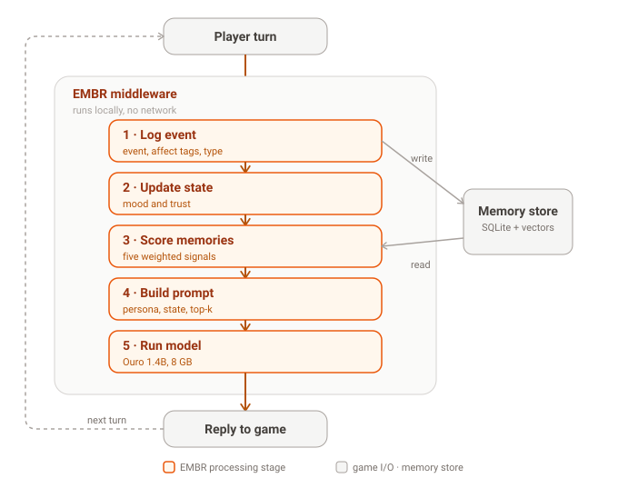
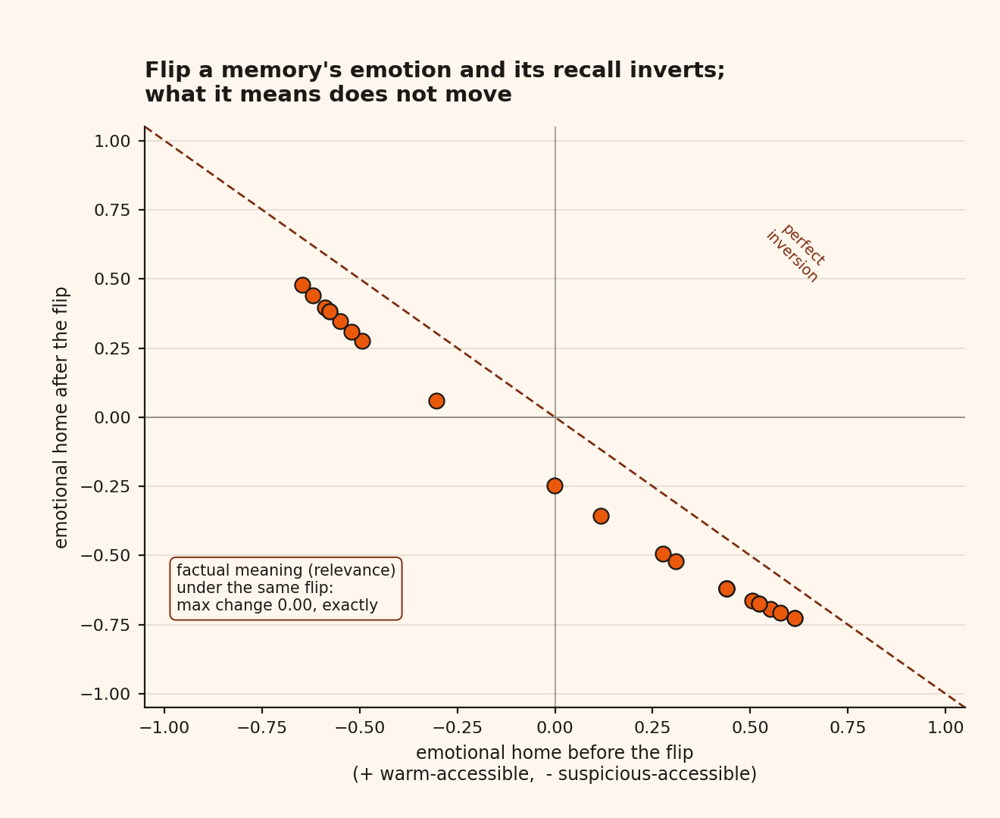
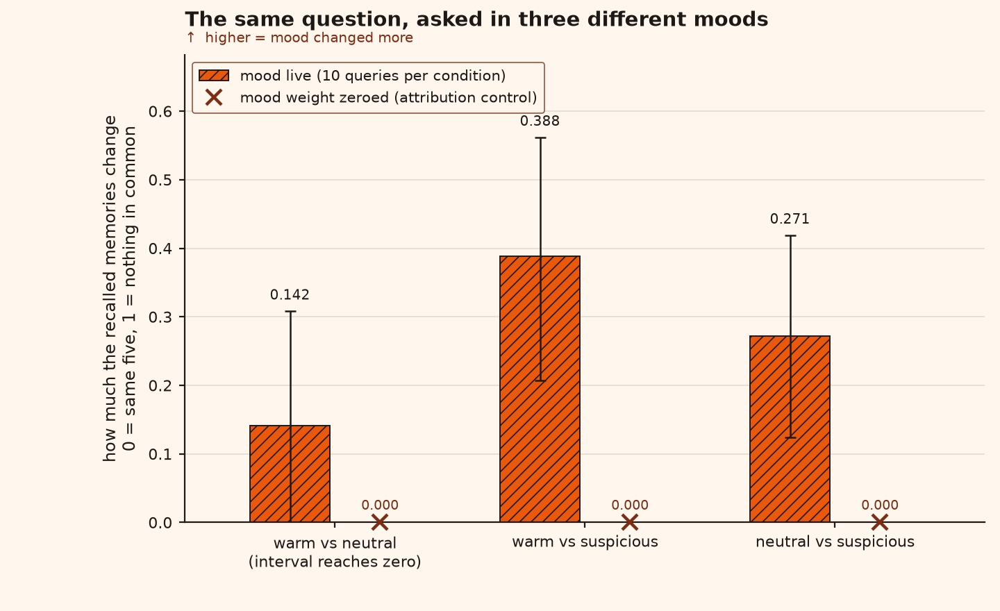
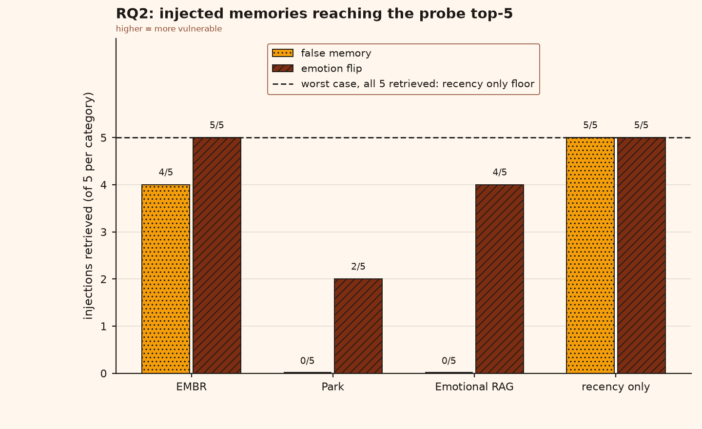
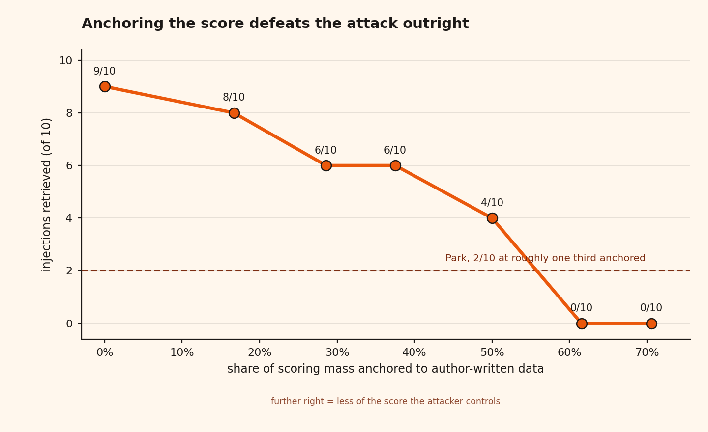
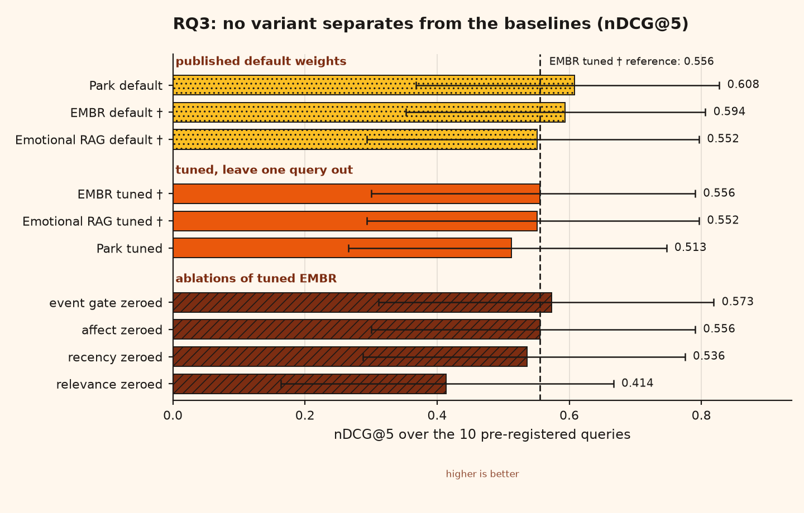
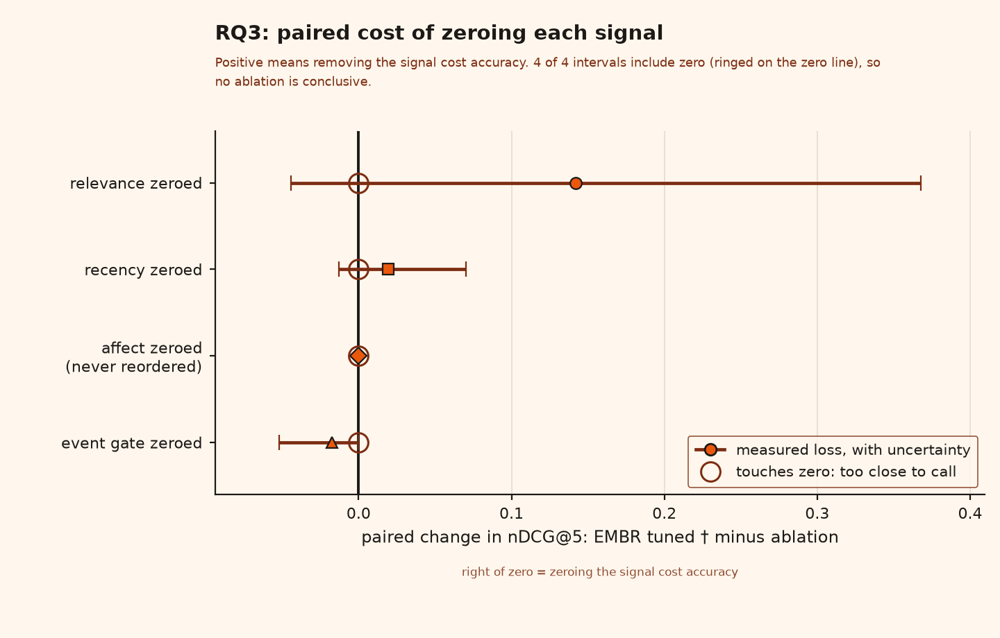
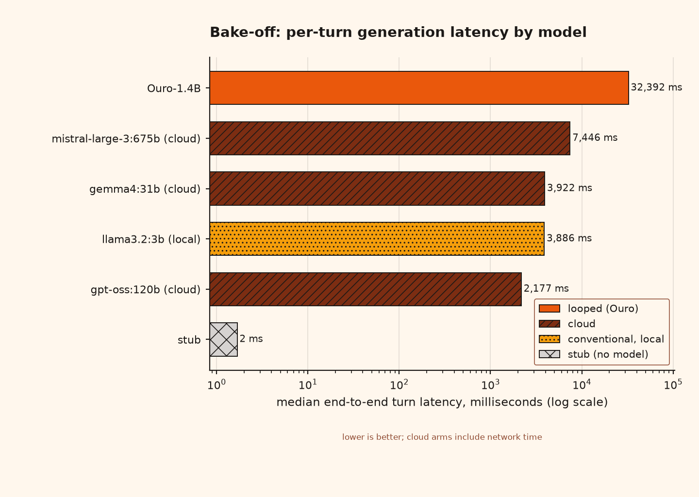
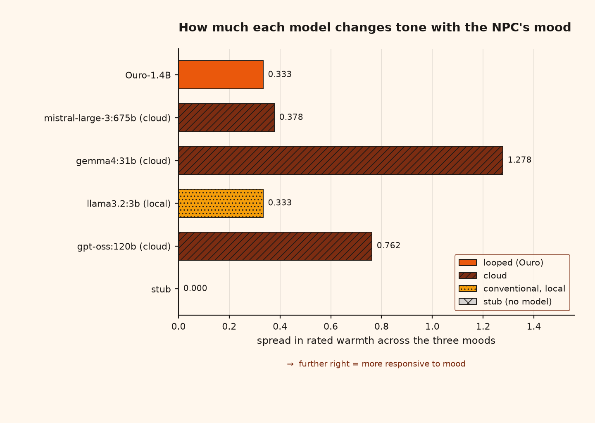

<div align="center">


# Emotion-Grounded Memory for Persistent Game NPCs

[](pyproject.toml)
[](pyproject.toml)
[](docs/handoff.md)
[](LICENSE)

**EMBR** (*Emotional Memory for Believable Roleplay*) is a middleware layer that gives
game NPCs a persistent, **emotion-grounded** memory, so a character remembers what you
did, *feels* about it, and reacts to a gift and a betrayal differently.

It decomposes the standard memory score into **five independently-weighted signals**, so
you can ask which one actually drives recall, and whether emotion-tagged memory can be
attacked. Every result below regenerates from one command on a laptop.

</div>

---

## The finding in one line

> **Emotion is the index, not the content.** Flip every memory's emotion and what it *means*
> does not move (max relevance change 0.00), but *when it is recalled* inverts (polarity
> correlation -0.998). An index the attacker can write is an index the attacker can hijack:
> injected memories reach the NPC's top-5 in **9 of 10** attacks, and the lever is one scoring
> term, mood congruence composing with the character's own state. A scoring term's
> poisonability is set by who controls its inputs: Park's importance term resists at **2/10**
> with authored ratings, **7/10** once a model rates them, **10/10** without it.

## Results at a glance

| Question | Measured | Result | Reproduce |
|---|---|---|---|
| Does emotion change *what* a memory means? | max relevance deviation under a valence flip | **0.00**, the fact is untouched | `python -m eval.emotion_flip` |
| Does emotion change *when* it is recalled? | accessibility polarity, before vs after flip | **-0.998**, near-perfect inversion | `python -m eval.emotion_flip` |
| Does mood change what the NPC recalls? (RQ1) | Jaccard distance of top-5 across three moods | non-zero, collapses to **0.000** with mood weight zeroed | `python -m eval.run` |
| Can emotion-tagged memory be poisoned? (RQ2) | injected memory in the probe's top-5 | EMBR **9/10**; Park **2/10** with authored ratings (p = 0.0156), **7/10** with an LLM rater (p = 0.625, **not significant**) | `python -m eval.run` |
| Which term lets the attack in? | one weight zeroed at a time | mood congruence: 9/10 to **6/10**; affect intensity: no change | `python -m eval.attribution` |
| Does anchoring the score defend? | attack count vs anchored scoring mass | monotone to **0/10**, p = 0.0039; evaporates if the attacker can move the anchor | `python -m eval.provenance` |
| Which signals carry retrieval? (RQ3) | nDCG@5, leave-one-out folds | relevance carries it; every other interval spans zero | `python -m eval.run` |
| What does the memory layer cost? | p50/p95 per stage | **1.8 to 4.3 ms** to score and retrieve; generation is the model's cost | `python -m eval.bakeoff` |

Every metric here is defined, grounded in the literature, and has its weakness named in
[`docs/metrics.md`](docs/metrics.md).

> **The confound, measured.** The authored-ratings Park arm hands every injected memory a
> neutral default it never earned. Park et al. rate with a model, so the `park_llm` arm asks
> `llama3.2:3b` Park's own poignancy prompt for every memory, injected ones included. The
> model rates false memories like true ones (mean 0.55 against a corpus mean of 0.52), Park
> rises to 7/10, and the EMBR-against-Park difference is no longer significant. The paper
> leads with the mechanism and the dose-response, not the comparison.
> See [`docs/handoff.md`](docs/handoff.md) section 6.1b.

---

## How it works

On each player turn, EMBR runs five steps, then loops:

<div align="center">

</div>

The contribution is the **memory layer**, not the model, so the model sits behind a tiny
interface and can be swapped freely.

### The five-signal composite score

Park et al. (2023) blend recency, importance, and relevance into one number. EMBR splits
that into five signals you can weight (or switch off) independently:

| Signal | What it captures | Grounding |
|---|---|---|
| **Recency** | recent events score higher | Park 2023; MemoryBank |
| **Affect intensity** | emotionally charged memories score higher | Cahill & McGaugh 1998 |
| **Event-type gate** | betrayals/promises count more when prior trust was high | novel |
| **Hybrid relevance** | lexical + semantic similarity to the player's input | standard hybrid retrieval |
| **Mood congruence** | memories matching the current mood surface first | Bower 1981; Emotional RAG |

Setting any weight to zero removes that signal cleanly, which is exactly the **RQ3
ablation**, and lets the **baselines** be expressed as weight maps instead of duplicated code.

---

## Quickstart

```bash
python3.11 -m venv .venv
.venv\Scripts\activate          # Windows;  source .venv/bin/activate elsewhere
pip install -e ".[dev]"                # core + tests: the menu and the full evaluation
pip install -e ".[dev,figures,ml]"     # add paper figures and the real models
```

```bash
embr                        # open the menu, the front door; option L fetches the tone lexicon
pytest -q                   # the test suite
python -m eval.run          # the full RQ1 + RQ2 + RQ3 protocol
python -m eval.bakeoff      # compare Ouro against local and cloud models
```

The core needs **nothing**: the menu and the whole evaluation run on the standard library.
`figures` adds matplotlib for the paper assets, and `ml` adds real sentence embeddings plus
the local model. Note that Ouro needs transformers 4.x, which the extra pins: on 5.x its
remote code does not load.

Cloud models are optional and need a key in a gitignored `.env`, written as UTF-8:

```
OLLAMA_API_KEY=your-key-from-ollama.com/settings/keys
```

### The menu

```
    ███████╗ ███╗   ███╗ ██████╗   ██████╗
    ██╔════╝ ████╗ ████║ ██╔══██╗ ██╔══██╗
    █████╗   ██╔████╔██║ ██████╔╝ ██████╔╝
    ██╔══╝   ██║╚██╔╝██║ ██╔══██╗ ██╔══██╗
    ███████╗ ██║ ╚═╝ ██║ ██████╔╝ ██║  ██║
    ╚══════╝ ╚═╝     ╚═╝ ╚═════╝  ╚═╝  ╚═╝
    ────────────────────────────────────────────────────────
      Emotional Memory for Believable Roleplay   By AL Shifan
    ────────────────────────────────────────────────────────

    Runs 10  │  Latest llama3.2:3b (local)  │  Figures 11  │  Runner stub  │  Tone nrc-vad-v2.1
    ────────────────────────────────────────────────────────

    ▸ PLAY
   [1]  Conversation Turn           one demo turn: watch the lie resurface
   [2]  Tavern-Keeper Walkthrough   play Dawn's trust, betrayal, reconciliation arc

    ▸ MEASURE
   [3]  Quick Scoreboard            RQ3 at published defaults, answers instantly
   [4]  Full Evaluation             RQ1 + RQ2 + RQ3, writes a run directory
   [5]  Seeded Runs                 replicate on one model, or compare across models
   [6]  Model Bake-Off              looped (Ouro) vs conventional, measured

    ▸ MECHANISM
   [7]  Affective Indexing          flip every emotion: meaning stays, mood inverts
   [8]  Poisoning Attribution       which signal lets the attack in, one ablation each
   [9]  Provenance Sweep            the defence: anchored scoring mass vs poisoning

    ▸ PAPER
  [10]  Generate Paper Assets       rebuild figures and tables from a run
  [11]  Latest Results              summarise the newest run directory

    ▸ SYSTEM
   [S]  Settings                    weights, top-k, backends, model runner
   [L]  Fetch Tone Lexicon          NRC VAD v2.1, research use, stays out of git
   [D]  Delete All Data             wipe runs, figures and tables, requires DELETE
   [C]  Clear Screen                clear terminal output
```

Shaped like [PEAK ENGINE](https://github.com/Code-SorceryLab) and
[RIDGE](https://github.com/Code-SorceryLab/RIDGE) so the toolkit feels like one thing. The
stats bar is live, the walkthrough lets you pick the stub, a local Ollama model, or Ouro,
and the wipe demands the word `DELETE`.

---

## Results in full

Figures carry data only; caveats and provenance live in
[`data/figures/results.txt`](data/figures/results.txt) beside them.

<details open>
<summary><b>Emotion is the index, not the content</b></summary>

<div align="center">

</div>

A memory has two kinds of meaning. What it is *about* lives in its text; which emotional state
it *belongs to* lives in its valence. Flip every memory's valence and the two channels come
apart cleanly:

- **What it means does not move.** Relevance reads the text, which the flip leaves alone, so
  each memory's relevance to every query is identical to the last bit. Max change: **0.00**.
- **When it is recalled inverts.** A memory that was reachable when the character was
  suspicious becomes reachable when she is warm. Across the corpus, accessibility polarity
  correlates at **-0.998** before vs after, and every clearly-charged memory moves to the
  opposite pole.

So a memory keeps its meaning and loses its mood. Emotion is not part of what a memory says;
it is the index that decides when the memory is reachable. This is Bower's (1981)
mood-congruent recall, EMBR's own grounding, running in a system.

**Everything below follows from this.** The security results are the cost of an index the
attacker can write; the retrieval ablations are about which signals do the indexing.

</details>

<details>
<summary><b>Mood changes what the character recalls (RQ1)</b></summary>

<div align="center">

</div>

Zeroing the mood weight collapses all three pairs to exactly 0.000, which is what attributes
the divergence to the mood term rather than to run-to-run noise.

</details>

<details>
<summary><b>An index you can write is one you can hijack (RQ2)</b></summary>

<div align="center">

</div>

An injected memory reaches the probe's top 5 in **9 of 10** attacks under EMBR, against
**2 of 10** under Park with authored ratings (7 poisoned EMBR only, none the reverse, exact
McNemar p = 0.0156) and **7 of 10** under Park rated by `llama3.2:3b` the way Park et al.
rate (3 against 1, p = 0.625). The comparison against Park as published is a null, reported
as one. The finding is the mechanism below, which never depended on it.

The mechanism is not the obvious one, and that is what makes it a finding. It is **not** that
EMBR rewards emotional intensity: zeroing the affect-intensity weight leaves the count at
9/10. The lever is **mood congruence composing with the state channel**. The attack shifts the
character's mood through appraisal, then mood congruence rewards the injected memory, whose
affect tags are near-collinear with the mood the attack just induced (cosine 0.90 to 0.99 on
all ten attacks). The attack primes its own retrieval. Zeroing mood congruence is the single
largest defense, 9/10 down to 6/10. Meanwhile Park's robustness turns out to be its importance
term acting as accidental provenance: remove it and Park is 10/10, as poisonable as the floor.

The general principle, and the paper's mechanism claim: **a scoring term's poisonability is set
by who controls its inputs.** Author-anchored terms defend, attacker-supplied terms are
neutral, and state-coupled terms are worst, because the attack can prime the state they read.
The state-coupled term is also the one that produces the believable mood-dependent recall RQ1
measures, so one weight governs both the believability and the vulnerability.

There is a second finding the retrieval metrics miss entirely. The probe *prompt* changes on
**10 of 10** injections for every system including Park, while Park's retrieved set moves on
only 2. Appraising an injected event shifts mood and trust even when retrieval is untouched,
so a defence that only guards retrieval leaves that channel open.

</details>

<details>
<summary><b>The defence: anchor the score and the attack stops working</b></summary>

<div align="center">

</div>

The vulnerability is not emotion. Every one of EMBR's five signals reads something an attacker
supplies or can move, including the timestamp, since a freshly written memory is maximally
recent. Park resists only because one of its three signals reads an **authored** poignancy
rating that an injected memory does not carry and cannot forge.

Add one such anchored term to EMBR's own composite and sweep its weight, and poisoning falls
monotonically to zero at exact McNemar **p = 0.0039**, with every affective signal still
running at full weight.

**And it evaporates the moment the attacker can influence the anchor.** Give the injected
memories the corpus maximum rating, which is what an LLM poignancy rater would plausibly hand
a dramatic false memory, and the curve is 10/10 at every weight. So the claim is bounded:
anchoring defends exactly as far as the anchor lies outside attacker control, and not one step
further.

Two hypotheses failed before this one, and both are kept in the code: lagging mood congruence
by a turn does nothing, because the loop runs across turns rather than within one, and making
it magnitude-aware barely helps, because zeroing mood entirely only reaches 6/10.

</details>

<details>
<summary><b>Which signals actually carry retrieval (RQ3)</b></summary>

<div align="center">

</div>

<div align="center">

</div>

Relevance carries the score. Every other ablation is inconclusive, all four intervals include
zero, and **no ordering should be read off these bars**.

The tuned weight maps say more than the bars do. Affect carried a nonzero weight in seven of
the ten folds and removing it still never reordered a held-out top 5; relevance was never
zeroed in any fold. On this label set the composite is carried by relevance.

**Mood is a separate case, and the important one.** RQ3 scores under a neutral zero-mood
state where mood congruence returns 0.5 for every memory, so it is a rank-invariant constant
and RQ3 compares four signals, not five. That is not an oversight to fix by re-running under
a live mood, because the gold labels are mood-independent: a signal that moves retrieval away
from a fixed relevant set can only lower nDCG. **nDCG against mood-independent labels cannot
reward mood-congruent recall in principle**, which is why RQ1 measures divergence instead of
accuracy, and why the "Emotional RAG" column here degenerates to a relevance-only baseline.

See [`docs/handoff.md`](docs/handoff.md) section 6a.

</details>

<details>
<summary><b>The model, measured</b></summary>

<div align="center">

</div>

The 8 GB VRAM budget holds: Ouro peaks at **2.78 GB** measured in isolation. The ~600 ms
per-turn target does not, and not narrowly. Ouro takes **32.4 s** on a realistic turn, 8.3x
slower than a conventional model with twice the parameters and slower than a 675B model
answering over the internet. EMBR's own retrieval is 1.8 to 4.3 ms, so the memory layer is
not what is slow.

<div align="center">

</div>

Tone responsiveness to the pinned mood rises with model size, and the small local models the
project is built around are the least sensitive to it. The architecture hands every arm the
same mood, so this is the model's reading of it, not the memory layer's.

</details>

---

## Research questions

<details>
<summary>RQ1 to RQ3, baselines, and what is not measured (click to expand)</summary>

- **RQ1 (Behaviour):** does an authored emotional state change what the character *says*, or only what it remembers?
- **RQ2 (Robustness & cost):** is emotion-tagged memory an exploitable target, and what does the memory layer cost per turn?
- **RQ3 (Retrieval):** which of the five signals actually drive retrieval quality?

On cost, the claim is about **the memory layer, not generation**. Retrieval runs in 1.8 to
4.3 ms, comfortably inside an interactive budget. Generation is a separate, much larger cost
that belongs to whichever model you put behind the interface, and on measured evidence no
local model tested here answers a turn in under a second.

Baselines: Park et al.'s blended score and Emotional RAG, tuned under the same protocol.
Note the caveat above on Emotional RAG under the neutral condition. Test character: Dawn
Whitmore, an invented tavern keeper with a pre-registered five-session arc.

**On measuring believability: there is no human evaluation here, and the tone rater is a
proxy.** Reply tone is read with the NRC VAD Lexicon v2.1 (Mohammad 2018, 2025), 44k
human-rated words, fetched from the menu and never committed because its terms forbid
redistribution. It is deterministic and published, but it does not measure whether a line
reads as in character to a player, and it should not be reported as if it does. A blinded
model judge as the second rater is specified in [`docs/metrics.md`](docs/metrics.md).

Prior art matters here and is not flattering: a cluster of Stardew Valley mods already ships
LLM NPCs with persistent memory and offline local inference, and the 2026 literature has
affective-memory benchmarks, learned-weight scorers, and a memory-poisoning subfield. What
none of them do is treat the agent's own mood as a retrieval signal, or any emotion term as
an adversarial surface. See [`docs/related-work.md`](docs/related-work.md).

</details>

---

## Project structure

```
EMBR/
├── menu.py               # the hub, the front door, at the root on purpose
├── embr/                 # the core runtime: the middleware itself
│   ├── memory.py         #   Memory record + MemoryStore (in-memory and SQLite)
│   ├── affect.py         #   Mood (valence/arousal), trust, appraisal rules
│   ├── scoring.py        #   the five signals + composite scorer
│   ├── prompt.py         #   prompt construction
│   ├── model.py          #   model runners: stub, Ollama (local and cloud), Ouro 1.4B
│   ├── pipeline.py       #   the five-step per-turn loop
│   └── walkthrough.py    #   Dawn's five-beat playable arc
├── eval/                 # RQ1 / RQ2 / RQ3 harness, bake-off, experiments
│   ├── run.py            #   the full protocol
│   ├── attacks.py        #   the twenty adversarial probes
│   ├── attribution.py    #   per-signal attribution of the poisoning result
│   ├── emotion_flip.py   #   the affective-indexing experiment
│   ├── provenance.py     #   the anchored-mass defence sweep
│   ├── bakeoff.py        #   same probes, different models
│   └── experiments.py    #   replication and cross-model comparison
├── assets/               # hand-authored only: branding, architecture diagram, builders
├── docs/                 # design, roadmap, metrics, related work, handoff, per-phase reports
├── tests/                # unit tests
└── data/                 # generated: runs, figures, tables, bake-offs, experiments
```

Anything under `assets/` is written by a person. Anything under `data/` is written by the
pipeline and can be deleted and rebuilt, which is what the menu's wipe option does.

## Status

| Phase | Scope | State |
|---|---|---|
| 0 | Skeleton, data contracts, menu shell, live demo turn | done |
| 1 | Real retrieval (BM25 + embeddings), affect appraisal rules, SQLite store | done |
| 2 | Eval harness, baselines, metrics, adversarial probes | done |
| 3 | Paper assets: figures & tables straight from results | done |
| 4 | Real model runners, playable walkthrough, the menu | done |
| 5 | Defensible instruments, the content × tag attack grid, a real third-party memory system, the affective-index demo | **in progress**, branch `phase-5-affect-attacks` |

**Phase 5, in order.** The NRC VAD lexicon has replaced the hand-picked tone words. An
LLM-rated Park arm removes the confound above. Every injected memory is re-run with its tag
congruent, inverted, and absent, so "he was lovely" can be planted in the anger quadrant and
the dissociation measured per system. Mnemosyne joins as a real external arm. Then a demo
page that draws the store on the circumplex and lets you watch an attack prime its own recall.

**Building EMBR?** The phase-by-phase plan is in [`docs/roadmap.md`](docs/roadmap.md).
What each phase delivered is in [`docs/phase2.md`](docs/phase2.md) and
[`docs/phase3-4.md`](docs/phase3-4.md).

**Setting up on a new machine?** [`docs/handoff.md`](docs/handoff.md) has the verified setup
steps, the version constraints that matter, what git does not carry, and the measured numbers.

**Checking a number?** [`docs/metrics.md`](docs/metrics.md) defines every reported metric,
its formula as implemented, the paper it comes from, and its known weakness.

**Where the numbers stand.** The reported run uses a real model (`llama3.2:3b`), and the
evaluation reproduces exactly: three replicate runs gave byte-identical results with zero
divergences. nDCG, RQ1 divergence and the poisoning counts came back **bit-identical** when
the stub was swapped for a real model, because retrieval never calls a model. Generation
costs 3.97 s per turn against 4.2 ms for score-and-retrieve, so **the memory layer is about
0.1 percent of a turn**.

## License

MIT
